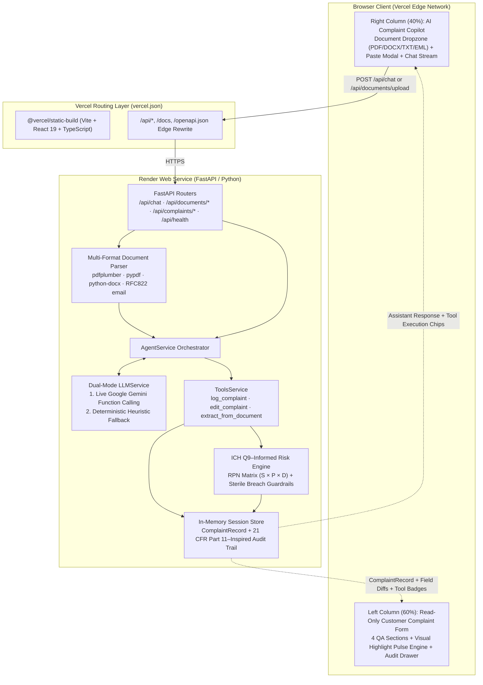

# PharmaCopilot: AI-Powered Customer Complaint Intake & Triage Prototype

An AI-powered customer complaint intake and triage assistant prototype tailored for pharmaceutical manufacturing quality assurance (Active Pharmaceutical Ingredients & Finished Dosage Forms).

Built to replicate the enterprise design and UX specified in [`docs/ProblemStatement.md`](docs/ProblemStatement.md) and [`assets/reference-image.png`](assets/reference-image.png), featuring an **ICH Q9–informed risk assessment** and **designed with auditability principles inspired by 21 CFR Part 11**.

---

## Live Deployment & Project URLs

| Component | Platform | Live URL |
| :--- | :--- | :--- |
| **Frontend Web Application** | **Vercel** | [https://pharmacopilot-one.vercel.app](https://pharmacopilot-one.vercel.app) |
| **Backend API Base URL** | **Render** | [https://pharmacopilot-backend-e59t.onrender.com](https://pharmacopilot-backend-e59t.onrender.com) |
| **Backend Health Check** | **Render / Vercel Proxy** | [https://pharmacopilot-backend-e59t.onrender.com/api/health](https://pharmacopilot-backend-e59t.onrender.com/api/health) · [https://pharmacopilot-one.vercel.app/api/health](https://pharmacopilot-one.vercel.app/api/health) |
| **Interactive API Docs (Swagger UI)** | **Render / Vercel Proxy** | [https://pharmacopilot-backend-e59t.onrender.com/docs](https://pharmacopilot-backend-e59t.onrender.com/docs) · [https://pharmacopilot-one.vercel.app/docs](https://pharmacopilot-one.vercel.app/docs) |
| **OpenAPI 3.1 Schema** | **Render / Vercel Proxy** | [https://pharmacopilot-backend-e59t.onrender.com/openapi.json](https://pharmacopilot-backend-e59t.onrender.com/openapi.json) |
| **GitHub Repository** | **GitHub** | [https://github.com/prathmeshmdeshmane001/PharmaCopilot](https://github.com/prathmeshmdeshmane001/PharmaCopilot) |

---

## Overview & Problem Context

In pharmaceutical manufacturing Quality Assurance (QA), customer complaints arrive through unstructured channels—hospital pharmacovigilance emails, PDF letters, Word investigation reports, and phone transcripts. Traditional quality management systems require QA specialists to manually transcribe dozens of fields across multi-tab forms before triaging severity, creating transcription errors, inconsistent risk scoring, and delayed containment of sterile or life-critical defects.

**PharmaCopilot** reimagines pharmaceutical complaint intake around three foundational principles:
1. **Zero-Manual-Edit Form Model**: The structured complaint form on the left side of the screen is a strictly read-only visual projection (`readOnly={true}`, `disabled={true}`, `tabIndex={-1}`) with zero manual Save or Submit buttons. All field creation and modification happen exclusively through natural language or document ingestion via the AI Copilot.
2. **Deterministic Partial Updates & Auditability**: Conversational edits apply an atomic JSON Merge Patch ($\text{State}_{t+1} = \text{State}_t \oplus \Delta_{\text{tool}}$), mutating only the requested fields while strictly preserving all untouched fields and appending every field-level transition (`old → new`) to an immutable audit trail **designed with auditability principles inspired by 21 CFR Part 11**.
3. **Hybrid ICH Q9–Informed Risk Assessment**: Every intake and risk-impacting edit automatically computes a quantitative Risk Priority Number ($\text{RPN} = \text{Severity} \times \text{Probability} \times \text{Detectability}$) combined with deterministic pharmaceutical safety guardrails (such as clamping sterile injectable container closure leaks or foreign particulate defects to `CRITICAL` / `P1 - Immediate Action Required`).

---

## System Architecture & Cloud Deployment Topology



---

## Key Architecture & Core Constraints

### 1. Two-Column Split-Screen (60 / 40)
- **Left Column (~60%) — Read-Only Customer Complaint Form**:
  - Organised into 4 standard enterprise QA sections:
    1. **Origin & Customer Details** (Complaint Source, Customer Name, Purchase/Dispensing Location, Rx Number)
    2. **Product & Batch Identification** (Product Name, Grade/Strength, Dosage Form, Packaging, Manufacturer, Batch/Lot Number, Manufacturing Date, Expiry Date, Affected Quantity & Units)
    3. **Complaint Details** (Defect Classification, Date Received, Verbatim Incident Description)
    4. **Risk Assessment** (Severity badge, Priority Level, RPN Score, Rationale, Recommended Actions, Departmental Routing, Regulatory Escalation Flag)
  - **Zero-Manual-Edit Architectural Model**: Form inputs render with standard enterprise styling (labels, borders, placeholder values), but are strictly read-only and non-focusable (`readOnly={true}`, `disabled={true}`, `tabIndex={-1}`). Users cannot manually type or alter values directly, and there are **no manual Save or Submit buttons**.
  - **Visual Highlight Pulse Engine**: Any field altered by the AI flashes with an animated indigo ring and an `"AI Updated"` / `"AI Populated"` pill badge for 2.5 seconds.
  - **Audit Trail Drawer**: Clickable header badge exposes complete 21 CFR Part 11–inspired revision history with timestamped field deltas and prompt provenance.

- **Right Column (~40%) — AI Complaint Copilot**:
  - **Document Dropzone**: Drag-and-drop ingestion of `.pdf`, `.docx`, `.txt`, and `.eml` files (up to 10MB).
  - **Text / Email Paste Modal**: Dialog for instant ingestion of raw customer emails or incident narratives.
  - **Extraction Progress Bar**: Real-time progress percentage during document parsing and entity extraction.
  - **Conversational Chat Stream**: Message history with tool execution badges (`[✓ Log Complaint]`, `[✓ Updated affected_quantity: 50 → 75]`, `[✓ Risk Assessment: CRITICAL]`).
  - **Suggested Action Chips**: One-click quick actions for rapid triage evaluation (`Log a new complaint`, `Change affected quantity`, `Update batch number`, `Check completeness`, `Summarize complaint`, `Recommend CAPA`).
  - **Sticky Chat Input Bar**: Conversational input with loading indicators and regulatory notice.

---

## Regulatory Phrasing & Prototype Scope

In accordance with compliance guidelines:
- **Risk Assessment**: Uses an **“ICH Q9–informed risk assessment”** model (utilising Severity, Probability, and Detectability matrices with automatic Critical guardrails for sterile breaches).
- **Auditability**: **“Designed with auditability principles inspired by 21 CFR Part 11”** (immutable audit records, previous/new value logging, timestamping, user prompt provenance).
- **Prototype Scope**: This software is an engineering **prototype** demonstrating automated intake and triage patterns.

---

## The 3 Mandatory Workflows

### Workflow 1: Natural Language Complaint Intake (`log_complaint`)
Users describe a complaint in conversational natural language. The AI parses the text into structured pharmaceutical entities, populates the read-only form with visual highlight pulses, and executes an ICH Q9–informed risk assessment.
> **Sample Prompt:**  
> *"Customer reported 50 vials of Epinephrine 1mg/mL Batch B24017 leaking around rubber seal at Mercy General Hospital on 2026-03-10."*
> 
> **Result:** Automatically sets severity to `CRITICAL`, priority to `P1 - Immediate Action Required`, flags mandatory regulatory escalation (sterile injectable seal failure), routes to Quality Assurance and Pharmacovigilance, and logs the initial audit entry.

### Workflow 2: Conversational Modification with Strict Preservation (`edit_complaint`)
Users can request modifications conversationally. The agent identifies the field delta, updates **only** the requested field, strictly preserves all other existing data, recalculates risk if the changed field is a risk factor, and highlights the updated field.
> **Sample Prompt:**  
> *"Actually, the affected quantity was 75 units, not 50."*
> 
> **Result:** Updates only `affected_quantity` from 50 to 75. All product names, batch numbers, dates, and customer details remain strictly preserved. The audit trail logs an update delta.

### Workflow 3: Document Upload & Seamless Follow-Up (`extract_from_document`)
Users can drag & drop or upload real-world files (PDF, DOCX, TXT, EML) up to 10MB or paste raw text. The ingestion pipeline extracts complaint details, populates the form, and allows immediate natural language follow-up edits.
> **Sample Follow-Up Prompt:**  
> *"The batch number is actually B24099."*
> 
> **Result:** Modifies the batch number while maintaining all extracted document entities.

---

## Backend API Endpoints

| Method | Endpoint | Description |
| :--- | :--- | :--- |
| `GET` | `/api/health` | Health check returning status, app version, environment, and active LLM provider mode. |
| `POST` | `/api/chat` | Primary conversational intake endpoint (`log_complaint`, `edit_complaint`, and QA triage Q&A). |
| `POST` | `/api/documents/upload` | Multipart file upload (`.pdf`, `.docx`, `.txt`, `.eml` up to 10MB) with structured extraction and risk evaluation. |
| `POST` | `/api/documents/paste` | Raw text / email narrative ingestion into structured complaint fields. |
| `GET` | `/api/complaints/active` | Retrieves the active `ComplaintRecord` (including risk assessment and audit trail) for a session. |
| `POST` | `/api/complaints/reset` | Resets the active session complaint state and audit history to a fresh empty record. |

---

## Repository Structure

```
PharmaCopilot/
├── vercel.json                        # Vercel frontend build & /api/* edge proxy configuration
├── render.yaml                        # Render Blueprint specification for the FastAPI backend
├── requirements.txt                   # Root Python dependencies
├── .env.example                       # Environment variables template
├── api/
│   └── index.py                       # Serverless Python entrypoint wrapper
├── run.bat                            # Windows one-click batch launcher
├── run.ps1                            # Windows PowerShell launcher
├── docs/                              # Comprehensive architecture & engineering specs
│   ├── ProblemStatement.md           # Original specification
│   ├── architecture.md               # System architecture & Mermaid diagrams
│   ├── implementation.md             # 8-phase implementation roadmap
│   ├── decision.md                   # ADRs (ADR-01 through ADR-07)
│   ├── edge-cases.md                 # Edge-cases & guardrails matrix
│   ├── tests.md                      # QA test plan
│   └── eval.md                       # Benchmarks (TC-01 through TC-10)
├── sample_data/                       # Test documents for Workflow 3
│   ├── CardioSafe_Quality_Complaint.pdf
│   ├── sample_complaint.txt          # Plain text incident narrative
│   ├── sample_complaint_letter.pdf   # Formatted hospital complaint letter (PDF)
│   ├── sample_email_complaint.eml    # RFC 822 hospital email complaint (EML)
│   └── sample_packaging_defect.docx  # Quality assurance investigation report (DOCX)
├── backend/                           # FastAPI backend
│   ├── app/
│   │   ├── main.py                   # FastAPI application entrypoint & CORS configuration
│   │   ├── config.py                 # Application settings & API keys
│   │   ├── models/complaint.py       # Pydantic schemas (ComplaintRecord, RiskAssessment, AuditEntry)
│   │   ├── services/
│   │   │   ├── agent.py              # Central agent coordinator
│   │   │   ├── llm.py                # Dual-mode (Gemini/OpenAI + deterministic heuristic fallback)
│   │   │   ├── tools.py              # Tool handlers (log_complaint, edit_complaint, extract_from_document)
│   │   │   ├── risk_engine.py        # ICH Q9–informed risk calculation & sterile guardrails
│   │   │   └── document_parser.py    # Multi-format parser (PDF, DOCX, TXT, EML)
│   │   ├── store/state_store.py      # In-memory thread-safe state store & audit trail
│   │   └── routers/
│   │       ├── chat.py               # /api/chat, /api/complaints/active, /api/complaints/reset
│   │       └── documents.py          # /api/documents/upload, /api/documents/paste
│   ├── tests/                        # 23 pytest unit & integration tests
│   ├── requirements.txt              # Backend Python dependencies
│   └── test_prototype.py             # Automated end-to-end verification script
└── frontend/                          # Vite React 19 + TypeScript + Tailwind CSS
    ├── src/
    │   ├── App.tsx                   # 60/40 Split layout container & Audit Drawer
    │   ├── types/complaint.ts        # TypeScript domain models
    │   ├── store/
    │   │   ├── useComplaintStore.ts  # Form state & visual highlight timers
    │   │   └── useChatStore.ts       # Chat stream, document upload & paste actions
    │   └── components/
    │       ├── form/                 # Left column (60%)
    │       │   ├── ComplaintFormContainer.tsx
    │       │   ├── sections/
    │       │   │   ├── OriginCustomerSection.tsx
    │       │   │   ├── ProductBatchSection.tsx
    │       │   │   ├── ComplaintDetailsSection.tsx
    │       │   │   └── RiskAssessmentSection.tsx
    │       │   └── controls/ReadOnlyField.tsx
    │       └── copilot/              # Right column (40%)
    │           ├── CopilotContainer.tsx
    │           ├── CopilotHeader.tsx
    │           ├── DocumentDropzone.tsx
    │           ├── ExtractionProgressBar.tsx
    │           ├── ChatMessageItem.tsx
    │           ├── SuggestedPrompts.tsx
    │           ├── ChatInputBar.tsx
    │           └── PasteModal.tsx
    └── package.json
```

---

## Environment Variables

Copy [`.env.example`](.env.example) to `.env` for local development, or configure these in your Render / Vercel dashboards:

| Variable | Default | Description |
| :--- | :--- | :--- |
| `GEMINI_API_KEY` | `""` | Google Gemini API key for live function calling (`log_complaint`, `edit_complaint`, `extract_from_document`). Falls back automatically to the deterministic extraction engine if omitted. |
| `OPENAI_API_KEY` | `""` | Optional OpenAI API key if `LLM_PROVIDER=openai`. |
| `LLM_PROVIDER` | `auto` | `auto`, `gemini`, `openai`, or `mock`. |
| `APP_ENV` | `production` | Application environment (`development` or `production`). |
| `APP_NAME` | `PharmaCopilot API` | Service display title in OpenAPI and `/api/health`. |
| `APP_VERSION` | `1.0.0` | Semantic version exposed by `/api/health`. |
| `DEBUG` | `false` | FastAPI debug toggle. |

---

## Local Quick Start Guide

### Prerequisites
- **Python 3.10+**
- **Node.js 18+** and **npm**

### Option A: One-Click Startup (Windows)
Double-click `run.bat` (or run `./run.ps1` in PowerShell).  
This automatically starts both the FastAPI backend and Vite frontend development server in separate windows.

### Option B: Manual Startup (macOS / Linux / Windows)

1. **Start the Backend:**
   ```bash
   cd backend
   python3 -m venv .venv
   source .venv/bin/activate  # On Windows: .\.venv\Scripts\activate
   pip install -r requirements.txt
   uvicorn app.main:app --host 127.0.0.1 --port 8000 --reload
   ```
   *The local backend API documentation is available at [http://127.0.0.1:8000/docs](http://127.0.0.1:8000/docs).*

2. **Start the Frontend:**
   ```bash
   cd frontend
   npm install
   npm run dev
   ```
   *Open [http://localhost:5173](http://localhost:5173) in your browser.*

---

## Automated Verification & Testing

PharmaCopilot includes an end-to-end test suite testing all 3 workflows, state delta preservation, sterile override guardrails, zero-manual-edit rules, and regulatory wording adherence:

```bash
cd backend
python test_prototype.py
```

To run the complete `pytest` test suite (23 unit and integration tests):
```bash
cd backend
python -m pytest -v
```

To test the frontend production build:
```bash
cd frontend
npm run build
```

---

## License & Compliance Notice

This project is developed as an engineering prototype for pharmaceutical complaint triage demonstration purposes.  
- Risk evaluations are **ICH Q9–informed risk assessments**.
- Audit trails are **designed with auditability principles inspired by 21 CFR Part 11**.
